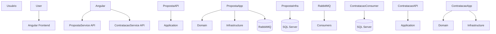
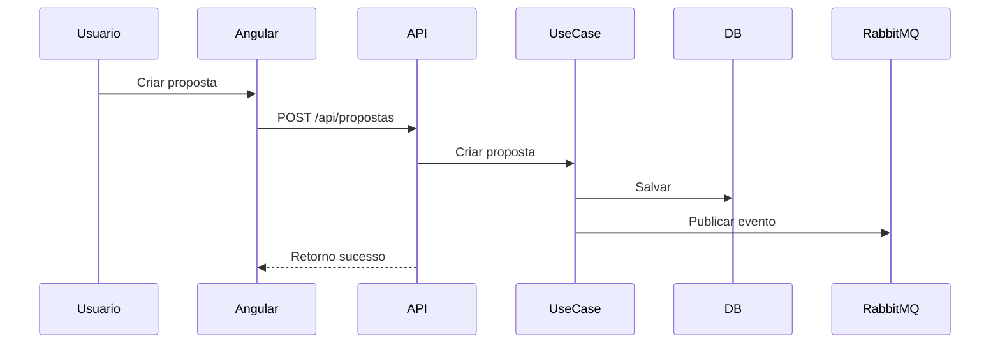

\# SDD - Plataforma de Seguro


\# 1. Objetivo


Desenvolver uma plataforma simples para gerenciamento de propostas de seguro e contratação de propostas aprovadas.


A solução deverá utilizar:


\- Arquitetura Hexagonal

\- Microserviços

\- Mensageria

\- APIs REST

\- SQL Server

\- Docker

\- Angular

\- Testes automatizados


O projeto terá foco em simplicidade, organização e facilidade de apresentação.


\---


\# 2. Visão Geral da Solução


A solução será dividida em:


```text

/front

/back

```


\## Front


Aplicação Angular responsável pela interface visual.


\## Back


Conjunto de microserviços .NET responsáveis pelas regras de negócio, persistência e mensageria.


\---


\# 3. Tecnologias


\## Backend


\- C#

\- .NET 8

\- ASP.NET Core

\- Entity Framework Core

\- SQL Server

\- RabbitMQ

\- MassTransit

\- Swagger

\- xUnit

\- FluentAssertions

\- Docker


\## Frontend


\- Angular

\- TypeScript

\- Angular Material

\- RxJS


\---


\# 4. Estrutura da Solução


```text

SeguroPlataforma

│

├── front

│   └── seguro-web

│

├── back

│   ├── src

│   │

│   │   ├── BuildingBlocks

│   │   │   ├── SharedKernel

│   │   │   └── Messaging

│   │   │

│   │   ├── PropostaService

│   │   │   ├── PropostaService.Api

│   │   │   ├── PropostaService.Application

│   │   │   ├── PropostaService.Domain

│   │   │   └── PropostaService.Infrastructure

│   │   │

│   │   └── ContratacaoService

│   │       ├── ContratacaoService.Api

│   │       ├── ContratacaoService.Application

│   │       ├── ContratacaoService.Domain

│   │       └── ContratacaoService.Infrastructure

│   │

│   ├── tests

│   │   ├── PropostaService.Tests

│   │   └── ContratacaoService.Tests

│   │

│   ├── docker-compose.yml

│   └── SeguroPlataforma.sln

│

└── docs

&#x20;   └── SDD.md

```


\---


\# 5. Arquitetura


A solução seguirá Arquitetura Hexagonal.


Cada microserviço possuirá:


```text

API

↓

Application

↓

Domain

↑

Infrastructure

```


\## 5.1 API


Responsável por:


\- Controllers

\- Swagger

\- Middlewares

\- Health Checks


\## 5.2 Application


Responsável por:


\- Casos de uso

\- DTOs

\- Interfaces

\- Regras de aplicação


\## 5.3 Domain


Responsável por:


\- Entidades

\- Enums

\- Regras de negócio

\- Validações


\## 5.4 Infrastructure


Responsável por:


\- Entity Framework

\- SQL Server

\- RabbitMQ

\- Repositórios

\- Adapters


\---


\# 6. Microserviços


\# 6.1 PropostaService


Responsável pelo gerenciamento das propostas.


\## Funcionalidades


\- Criar proposta

\- Listar propostas

\- Filtrar propostas por status

\- Buscar proposta por ID

\- Alterar status

\- Publicar eventos


\## Status possíveis


```text

EmAnalise

Aprovada

Rejeitada

```


\## Eventos publicados


```text

PropostaCriadaEvent

PropostaAprovadaEvent

PropostaRejeitadaEvent

```


\---


\# 6.2 ContratacaoService


Responsável pela contratação.


\## Funcionalidades


\- Contratar proposta

\- Listar contratações

\- Buscar contratação por ID

\- Validar status da proposta

\- Consumir eventos


\## Eventos consumidos


```text

PropostaAprovadaEvent

PropostaRejeitadaEvent

```


\---


\# 7. Comunicação entre Serviços


\# 7.1 REST


Usado para:


\- Consultas

\- Operações síncronas


\# 7.2 RabbitMQ


Usado para:


\- Eventos

\- Comunicação assíncrona

\- Desacoplamento


Fluxo:


```text

Proposta alterada

&#x20;   ↓

Evento publicado

&#x20;   ↓

RabbitMQ

&#x20;   ↓

ContratacaoService consome

```


\---


\# 8. Banco de Dados


Será utilizado SQL Server em Docker.


Cada serviço terá seu próprio banco lógico.


```text

SeguroPropostaDb

SeguroContratacaoDb

```


\---


\# 9. Modelo de Domínio


\# 9.1 Proposta


```text

Proposta

\- Id

\- NomeCliente

\- DocumentoCliente

\- TipoSeguro

\- ValorSeguro

\- Status

\- DataCriacao

\- DataAtualizacao

```


\---


\# 9.2 Contratacao


```text

Contratacao

\- Id

\- PropostaId

\- DataContratacao

```


\---


\# 9.3 PropostaResumo


```text

PropostaResumo

\- PropostaId

\- Status

\- DataAtualizacao

```


\---


\# 10. Regras de Negócio


\# 10.1 Proposta


\- Toda proposta nasce EmAnalise

\- Pode ser aprovada

\- Pode ser rejeitada

\- Toda alteração publica evento


\# 10.2 Contratação


\- Somente proposta aprovada pode ser contratada

\- Não permitir contratação duplicada

\- Deve armazenar data da contratação


\---


\# 11. Endpoints


\# 11.1 PropostaService


\## Criar proposta


```http

POST /api/propostas

```


\---


\## Listar propostas


```http

GET /api/propostas

```


\---


\## Filtrar por status


```http

GET /api/propostas?status=EmAnalise

GET /api/propostas?status=Aprovada

GET /api/propostas?status=Rejeitada

```


\---


\## Buscar por ID


```http

GET /api/propostas/{id}

```


\---


\## Alterar status


```http

PATCH /api/propostas/{id}/status

```


Request:


```json

{

&#x20; "status": "Aprovada"

}

```


\---


\# 11.2 ContratacaoService


\## Contratar proposta


```http

POST /api/contratacoes

```


Request:


```json

{

&#x20; "propostaId": "uuid"

}

```


\---


\## Listar contratações


```http

GET /api/contratacoes

```


\---


\## Buscar contratação


```http

GET /api/contratacoes/{id}

```


\---


\# 12. Frontend Angular


Será desenvolvido um frontend simples em Angular.


Objetivo:


\- Facilitar demonstração

\- Consumir APIs

\- Exibir propostas

\- Permitir ações


\---


\# 12.1 Tela Principal


A aplicação terá uma tela principal de propostas.


\## Colunas


```text

Cliente

Documento

Tipo Seguro

Valor

Status

Data Criação

Ações

```


\---


\# 12.2 Filtro


A tela terá filtro por status.


\## Opções


```text

Todos

Em Análise

Aprovada

Rejeitada

```


Ao alterar o filtro:


```text

Frontend chama:

GET /api/propostas?status=

```


\---


\# 12.3 Ações


Cada linha terá:


```text

\[Aprovar]

\[Rejeitar]

```


Regras:


\- Apenas propostas EmAnalise terão ações habilitadas

\- Após alteração, a tabela será recarregada


\---


\# 12.4 Estrutura Angular


```text

src/app

│

├── pages

│   └── propostas

│

├── services

│   └── proposta.service.ts

│

├── models

│   └── proposta.model.ts

│

└── shared

```


\---


\# 13. Segurança


O Swagger será protegido com Basic Authentication.


\## Credenciais


```text

Usuário: admin

Senha: admin

```


A autenticação será aplicada apenas ao Swagger.


\---


\# 14. Docker


A solução será executada com Docker Compose.


\## Containers


```text

proposta-api

contratacao-api

sqlserver

rabbitmq

```


\---


\# 15. RabbitMQ


Painel administrativo:


```text

http://localhost:15672

```


Credenciais padrão:


```text

guest / guest

```


\---


\# 16. Health Checks


Cada API terá:


```http

GET /health

```


Validando:


\- API online

\- SQL Server

\- RabbitMQ


\---


\# 17. Testes


\# 17.1 PropostaService.Tests


\## Cenários


\- Criar proposta

\- Aprovar proposta

\- Rejeitar proposta

\- Filtrar por status

\- Publicar eventos


\---


\# 17.2 ContratacaoService.Tests


\## Cenários


\- Contratar proposta aprovada

\- Bloquear proposta rejeitada

\- Bloquear proposta em análise

\- Impedir duplicidade

\- Consumir eventos


\---


\# 18. Migrations


Cada microserviço terá suas migrations.


```text

PropostaService.Infrastructure/Migrations


ContratacaoService.Infrastructure/Migrations

```


\---


\# 19. Diagrama Geral





\---


\# 20. Fluxo de Proposta





\---


\# 21. Fluxo de Contratação

```mermaid

sequenceDiagram



participant Usuario

participant Angular

participant ContratacaoAPI

participant ContratacaoUseCase

participant PropostaResumo

participant ContratacaoDB



Usuario->>Angular: Contratar proposta

Angular->>ContratacaoAPI: POST /api/contratacoes

ContratacaoAPI->>ContratacaoUseCase: Validar proposta



ContratacaoUseCase->>PropostaResumo: Consultar status



alt Proposta Aprovada

&#x20;   ContratacaoUseCase->>ContratacaoDB: Criar contratação

&#x20;   ContratacaoAPI-->>Angular: Sucesso

else Não aprovada

&#x20;   ContratacaoAPI-->>Angular: Erro

end

```





\---


\# 22. Critérios de Aceite


\- Criar proposta

\- Listar propostas

\- Filtrar propostas

\- Alterar status

\- Publicar eventos

\- Consumir eventos

\- Contratar proposta aprovada

\- Bloquear contratação inválida

\- Persistir dados

\- Swagger protegido

\- Docker funcionando

\- Angular funcionando

\- Testes automatizados


\---


\# 23. README


O README deverá conter:


\- Tecnologias

\- Como executar

\- Docker Compose

\- Como acessar Swagger

\- Usuário e senha Swagger

\- Como acessar RabbitMQ

\- Como executar migrations

\- Como executar testes

\- Fluxo da aplicação


\---


\# 24. Estratégia de Apresentação


\## Fluxo sugerido


1\. Explicar arquitetura

2\. Mostrar Docker Compose

3\. Mostrar Swagger protegido

4\. Criar proposta

5\. Aprovar proposta

6\. Mostrar RabbitMQ

7\. Mostrar Angular atualizando

8\. Contratar proposta

9\. Mostrar testes

10\. Explicar decisões técnicas


\---


\# 25. Decisões Arquiteturais


\## SQL Server


Escolhido por ser amplamente utilizado em ambientes .NET corporativos.


\## RabbitMQ


Escolhido para desacoplamento e comunicação assíncrona.


\## Angular


Escolhido para facilitar demonstração visual.


\## Arquitetura Hexagonal


Escolhida para separação de responsabilidades e baixo acoplamento.


\## Simplicidade


A solução evita complexidades desnecessárias como:


\- Kubernetes

\- Saga

\- CQRS completo

\- Event Sourcing

\- OAuth complexo


Mantendo foco em clareza e facilidade de apresentação.


\---


\# 26. Conclusão


A solução proposta atende aos requisitos do teste técnico utilizando:


\- .NET 8

\- Arquitetura Hexagonal

\- Microserviços

\- RabbitMQ

\- SQL Server

\- Angular

\- Docker

\- Testes automatizados


O projeto foi desenhado para ser simples, organizado, funcional e fácil de apresentar.


\---

\# 27. Atualizacoes Implementadas

Esta secao registra os ajustes realizados durante a implementacao inicial do projeto.

\## 27.1 Backend

\- Solucao .NET criada em `back/SeguroPlataforma.sln`
\- Microservicos `PropostaService` e `ContratacaoService` criados em arquitetura hexagonal
\- APIs REST publicadas em Docker:

```text
PropostaService: http://localhost:5001
ContratacaoService: http://localhost:5002
```

\- Swagger habilitado:

```text
http://localhost:5001/swagger
http://localhost:5002/swagger
```

\- SQL Server conectado via EF Core
\- Bancos criados automaticamente na inicializacao:

```text
SeguroPropostaDb
SeguroContratacaoDb
```

\- Health checks validam conexao com banco:

```http
GET /health
```

\## 27.2 Docker

Credenciais sincronizadas entre Docker e backend.

\### SQL Server

```text
Host interno: sqlserver
Porta: 1433
Usuario: sa
Senha: Seguro@12345
```

\### RabbitMQ

```text
Host interno: rabbitmq
Porta: 5672
Painel: http://localhost:15672
Usuario: guest
Senha: guest
```

\## 27.3 Tipos de Seguro

O tipo de seguro deixou de ser texto livre e passou a ser um enum no dominio, persistido como texto no banco.

Tambem foi criada a tabela de dominio `TiposSeguro`, semeada automaticamente com:

```text
Seguro Auto
Seguro Residencial
Seguro Vida
Seguro Empresarial
Seguro Viagem
Seguro Saude
Seguro Odontologico
Seguro Moto
Seguro Celular
Seguro Equipamentos
Seguro Patrimonial
Seguro Condominio
Seguro Previdencia
Seguro Rural
Seguro Nautico
Seguro Transporte
Seguro Responsabilidade Civil
Seguro Pet
Seguro Acidentes Pessoais
Seguro Garantia
```

Endpoint criado para consulta dos tipos:

```http
GET /api/tipos-seguro
```

\## 27.4 Frontend

\- Angular configurado com rotas:

```text
/
/propostas
/propostas/nova
```

\- Tela principal lista propostas consumindo:

```http
GET http://localhost:5001/api/propostas
```

\- Tela de criacao de proposta criada
\- Campo `TipoSeguro` usa combo carregado de:

```http
GET http://localhost:5001/api/tipos-seguro
```

\- Datas formatadas em `pt-BR`
\- Status e tipo de seguro exibidos como texto amigavel

\## 27.5 Valores do Enum TipoSeguro

O enum `TipoSeguro` usa valores tecnicos sem acentos para manter compatibilidade com C#, JSON e SQL Server.

```text
Auto
Residencial
Vida
Empresarial
Viagem
Saude
Odontologico
Moto
Celular
Equipamentos
Patrimonial
Condominio
Previdencia
Rural
Nautico
Transporte
ResponsabilidadeCivil
Pet
AcidentesPessoais
Garantia
```

Os nomes exibidos para o usuario sao retornados pelo endpoint `GET /api/tipos-seguro`.

\## 27.6 Comandos de Execucao

Subir infraestrutura e APIs:

```powershell
docker compose -f back\docker-compose.yml up --build -d
```

Acompanhar logs:

```powershell
docker compose -f back\docker-compose.yml logs -f proposta-api contratacao-api
```

Subir frontend Angular:

```powershell
cd front\seguro-web
npm.cmd start
```

\## 27.7 Estado Atual

Implementado:

\- PropostaService com persistencia SQL Server
\- ContratacaoService com persistencia SQL Server
\- Docker Compose com SQL Server, RabbitMQ e APIs
\- Swagger nas duas APIs
\- Health checks com validacao de banco
\- Tela de listagem de propostas
\- Tela de criacao de propostas
\- Combo de tipos de seguro carregado do backend
\- Formatacao pt-BR no frontend
\- Testes automatizados principais

Pendente para evolucao:

\- Integrar publicacao e consumo real com MassTransit/RabbitMQ
\- Implementar autenticacao Basic no Swagger
\- Criar migrations formais em vez de `EnsureCreated`
\- Conteinerizar o frontend Angular
